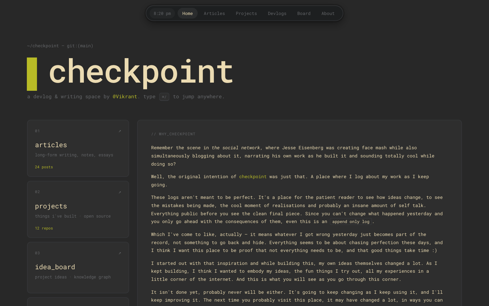
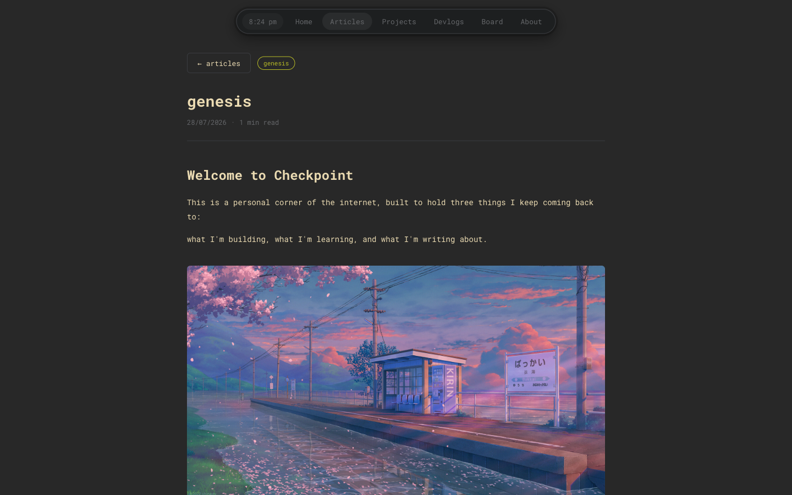
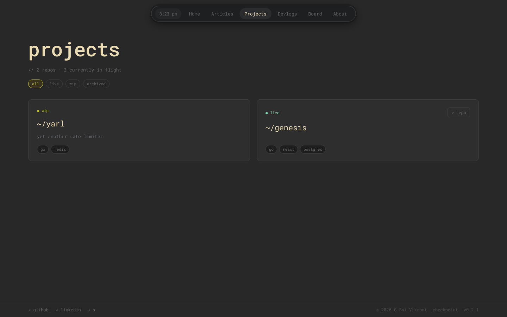
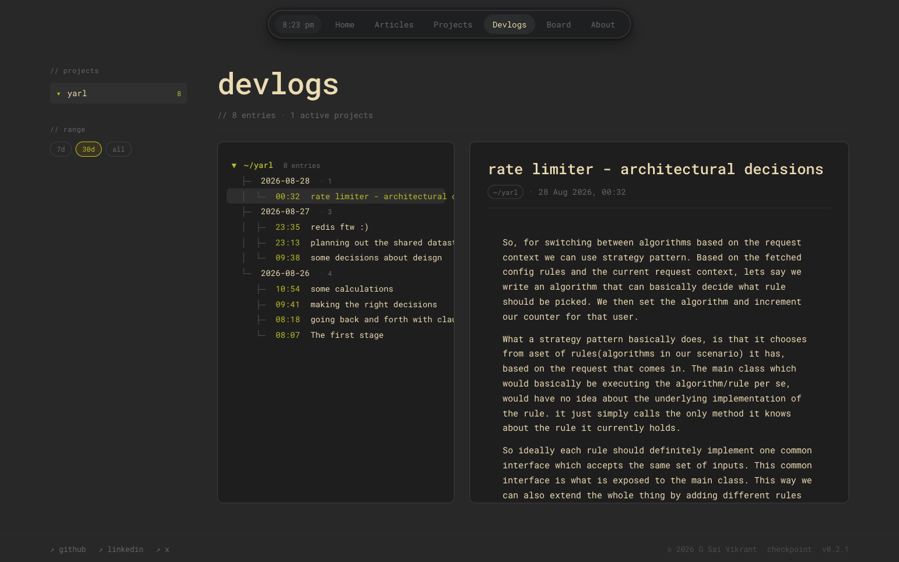
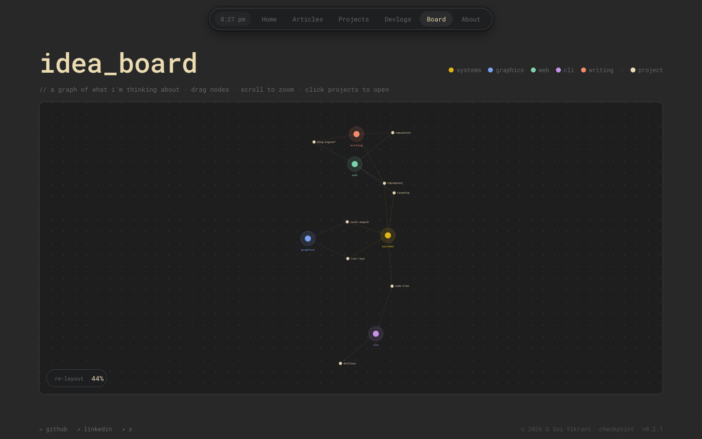
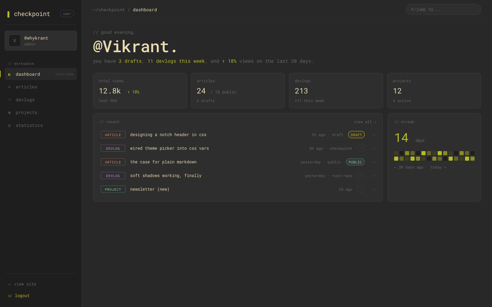
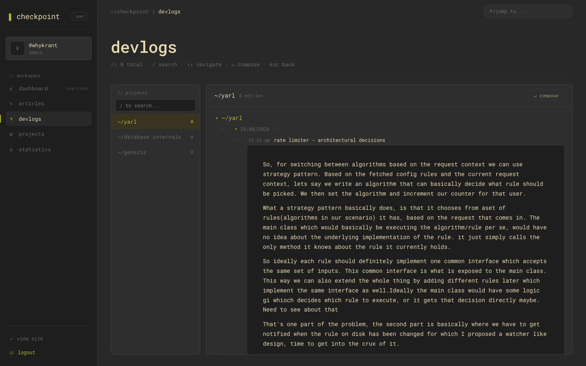
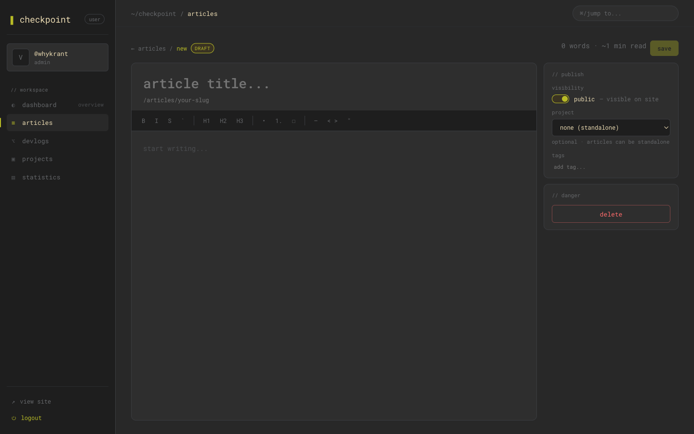

<h1>&nbsp; checkpoint</h1>

**A personal documentation, blogging, and portfolio platform — built as an append-only log of what I'm building, learning, and writing.**

Articles, devlogs, project tracking, and a knowledge-graph board, wrapped in a Monkeytype-inspired dark terminal theme.

[**→ Live site: checkpoint.vikrant.app**](https://checkpoint.vikrant.app)




---

## Table of Contents

- [What is checkpoint?](#what-is-checkpoint)
- [Public side](#public-side)
- [Author side](#author-side)
- [Tech stack](#tech-stack)
- [Architecture Highlights](#architecture-highlights)
- [Features](#features)
- [Project structure](#project-structure)
- [Roadmap](#roadmap)

## What is checkpoint?

checkpoint is a self-hosted alternative to scattering your writing across Medium, a private notes app, and a half-finished portfolio site. It's one place for:

- **Articles** — long-form writing and essays
- **Devlogs** — timestamped, per-project build logs (an append-only record of decisions, dead ends, and "aha" moments)
- **Projects** — a portfolio of things built, with status (live / WIP / archived) and tags
- **idea_board** — a force-directed knowledge graph linking projects, tags, and half-formed ideas

Everything is public by default — the philosophy (see the [genesis article](https://checkpoint.vikrant.app/articles/genesis)) is that the messy, in-progress version of the work is worth showing, not just the polished final piece.

## Public side

The visitor-facing site is a single-page terminal-styled shell — `Home · Articles · Projects · Devlogs · Board · About`.

<table>
<tr>
<td width="50%">

**Article reading view**


</td>
<td width="50%">

**Projects**


</td>
</tr>
<tr>
<td width="50%">

**Devlogs** — a `git log`-style tree of dated entries per project


</td>
<td width="50%">

**idea_board** — a d3-force knowledge graph, draggable and zoomable


</td>
</tr>
</table>

## Author side

Behind auth (Clerk), the `/user` workspace is where content actually gets written and tracked — a dashboard, per-project devlogs, and a Tiptap-based markdown editor.

> **Note:** The dashboard and stats shown here (views, streaks, referrers) are currently **static/mocked** — no analytics pipeline exists yet. A real analytics service to record actual usage is planned; see [`BACKLOG.md`](./BACKLOG.md#medium-backend).

**Dashboard** — recent activity, drafts, streaks


**Devlogs** — per-project entries with search, keyboard navigation, and one-key compose


**Markdown editor** — Tiptap-based, with visibility toggles and project linking


## Tech stack

**Backend** (`apps/backend`)
- Go 1.26
- [Echo](https://echo.labstack.com/) — HTTP framework
- PostgreSQL via [pgx/v5](https://github.com/jackc/pgx) — connection pooling, no ORM
- [sqlc](https://sqlc.dev/) — generates typed Go from raw SQL queries
- [tern](https://github.com/jackc/tern) — database migrations
- [Clerk](https://clerk.com/) — authentication, JWT sessions
- [Zerolog](https://github.com/rs/zerolog) + [New Relic](https://newrelic.com/) — structured logging & APM tracing
- [Koanf](https://github.com/knadh/koanf) — env-based configuration
- [go-playground/validator](https://github.com/go-playground/validator) — request validation
- [golang.org/x/time/rate](https://pkg.go.dev/golang.org/x/time/rate) — in-memory rate limiting

**Frontend** (`apps/frontend`)
- React 18 + Vite
- React Router
- Tiptap — rich text / markdown editor (with collaborative editing via Yjs)
- Mermaid — diagram rendering
- d3-force — knowledge graph / board layout
- Vitest + Testing Library

**Infra**
- Docker / docker-compose (PostgreSQL, and the full production stack)
- GitHub Actions — CI (path-filtered backend/frontend jobs) + backend image publishing to GHCR
- [Diun](https://crazymax.github.io/diun/) + [webhook](https://github.com/adnanh/webhook) — self-hosted, health-gated auto-deploy on the VPS
- [Caddy](https://caddyserver.com/) — reverse proxy in front of the API and static frontend

## Architecture Highlights

### Authentication
- [Clerk](https://clerk.com/) handles login/register and session issuance; the backend verifies Clerk-issued JWTs on protected routes rather than owning credentials itself.
- A Clerk webhook keeps user records in sync (`CHECKPOINT_AUTH.WEBHOOK_SECRET`), and `CHECKPOINT_AUTH.DEFAULT_ROLE` seeds new users into the RBAC groundwork (owner/visitor visibility rules).

### Observability
- **Zerolog** for structured logging (console output locally, with request-ID correlation on every log line) and slow-query logging in the database layer.
- **New Relic APM** for distributed tracing across the middleware pipeline (rate limiter → CORS → security headers → request ID → tracing → context → logger → panic recovery).
- `GET /status` health endpoint, used both by the CI Postgres service check and by the production deploy pipeline's rollback gate (see below).

### CI/CD & Deployment
1. **CI** (`.github/workflows/ci.yml`) — path-filtered so backend and frontend only build/lint/test when their own files change; backend tests run against a real Postgres service container (no mocking, per project convention).
2. **Image publish** (`.github/workflows/publish-backend.yml`) — on a `v*` tag pointing at `master`, diffs against the previous tag and only builds/pushes a new `ghcr.io/saivikrantg/checkpoint-backend` image if `apps/backend` actually changed.
3. **Auto-deploy** (`deploy/`) — a small self-hosted pipeline on the VPS:
   - **Diun** polls GHCR every 2 minutes for a new image tag.
   - On a new tag, Diun calls a **webhook** container (auth'd via a shared secret), which runs `deploy-backend.sh`.
   - That script pulls the new image, brings it up, and **health-checks it against `/status`** with retries — if it fails, it **automatically rolls back** to the last-known-good tag and sends a notification (via ntfy), so a bad deploy never sits in production unattended.
   - **Caddy** fronts the stack as a reverse proxy for the API and static frontend.

## Features

### Available now
- Clerk-based authentication (login/register)
- Articles: create, edit, and view (owner + public read)
- Devlogs: per-project dev logs with caching on the frontend
- Projects: CRUD with public/private visibility
- Project board with a graph-style layout
- Admin dashboard + stats page UI (⚠️ currently static/mocked data — no analytics pipeline wired up yet)
- Owner/visitor content visibility rules (RBAC groundwork)
- Rate limiting, CORS, security headers, request tracing, structured logging, New Relic APM
- OpenAPI docs endpoint

### Planned / in progress
See [`BACKLOG.md`](./BACKLOG.md) for the full list. Highlights:
- **Analytics service** to actually record and serve usage stats (the admin stats page is currently static/mocked)
- Search index endpoint for the command-palette ("Finder") to surface articles/projects/devlogs dynamically
- Inline field-level validation errors on the frontend forms
- Admin cross-user read access (full RBAC)
- Article view counts (column exists, increment not wired up)
- Devlog batch sync + offline mode with local queue
- Calendar view for devlogs
- Server-rendered public pages for SEO/social previews
- Repository interfaces + error sentinels for DB backend swappability
- Redis-backed rate limiter (currently in-memory)
- Grafana-based logging (currently Zerolog + New Relic)

## Project Structure

```
checkpoint/
├── apps/
│   ├── backend/     # Go API service (Echo, clean architecture)
│   └── frontend/    # React app (Vite)
├── deploy/          # Deployment scripts
├── docs/            # Project documentation
├── scripts/         # Utility scripts
├── docker-compose.yml
├── BACKLOG.md
└── CLAUDE.md        # Architecture & conventions reference
```

For backend architecture details (clean architecture layers, request flow, endpoint-creation workflow), see [`CLAUDE.md`](./CLAUDE.md).

## Roadmap

Full list of planned work lives in [`BACKLOG.md`](./BACKLOG.md) — search index, offline devlog sync, SSR public pages, RBAC, and more.

---

Built by [@Vikrant](https://github.com/SaiVikrantG) — [GitHub](https://github.com/SaiVikrantG) · [LinkedIn](https://www.linkedin.com/in/saivikrantg) · [X](https://x.com/whykrant)
