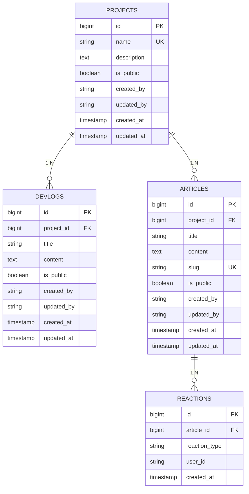

# Entity Relationship Diagram

## Database Schema

## Relationships Summary

| From | To | Type | Notes |
|------|-----|------|-------|
| PROJECTS | DEVLOGS | 1:N | One project has many devlogs; CASCADE on delete |
| PROJECTS | ARTICLES | 1:N | One project has many articles; SET NULL on delete (optional) |
| ARTICLES | REACTIONS | 1:N | One article has many reactions; CASCADE on delete |

## Key Fields

- **created_by**: Stores Clerk user_id (or custom auth user identifier)
- **updated_by**: Tracks who last modified the record
- **is_public**: Boolean flag for visibility control
- **content**: Markdown format (articles & devlogs)
- **slug**: URL-friendly identifier for articles

## Notes

- All `created_by` fields are required (tracks content ownership)
- All `updated_by` fields are optional (not set on creation)
- Devlogs always belong to a project (NOT NULL)
- Articles can exist without a project (optional, SET NULL if project deleted)
- Reactions are article-only (no devlog reactions)
